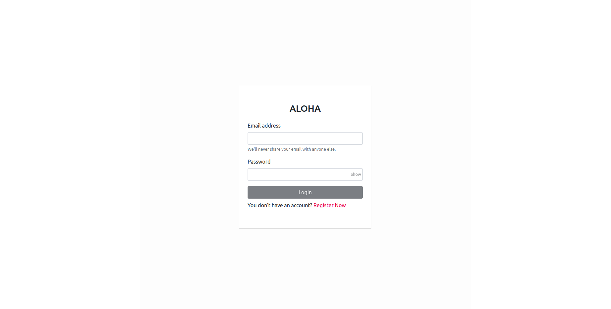
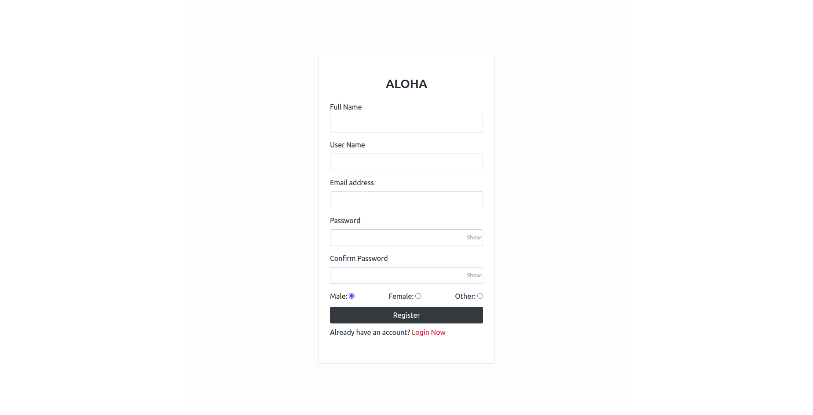
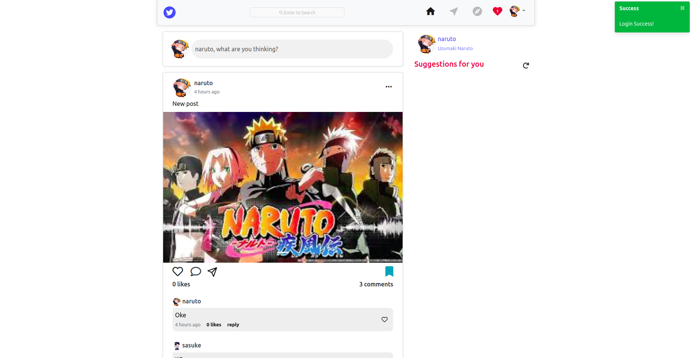
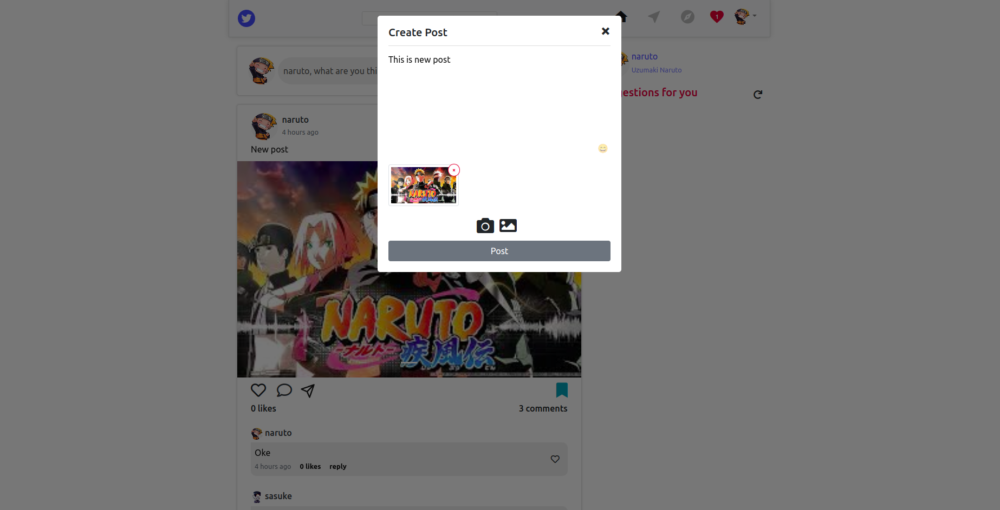
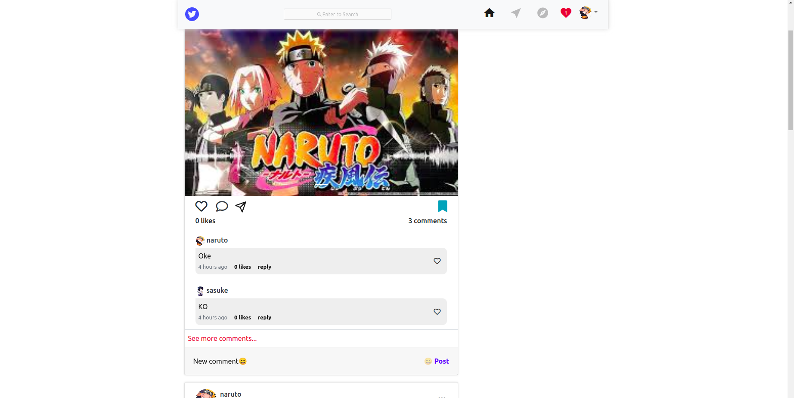
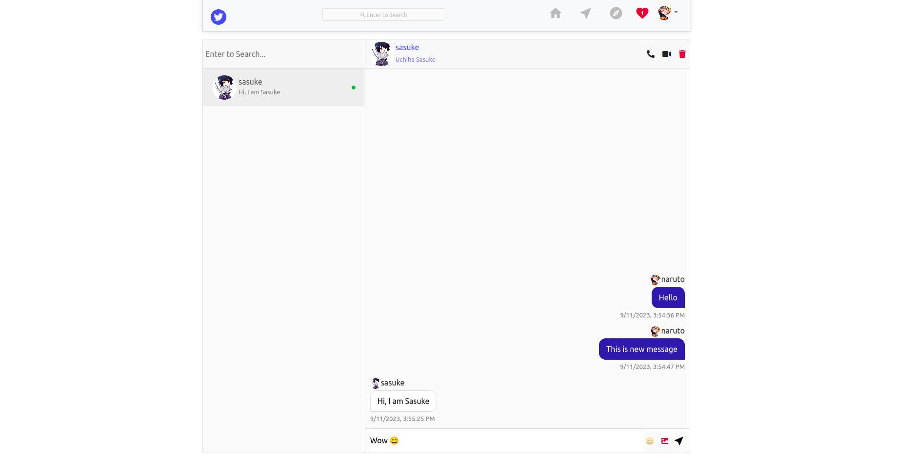
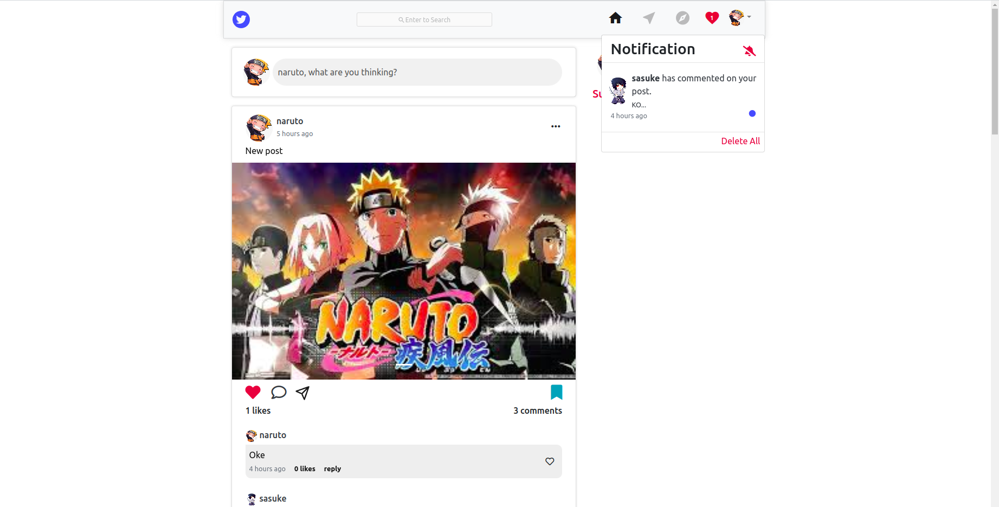
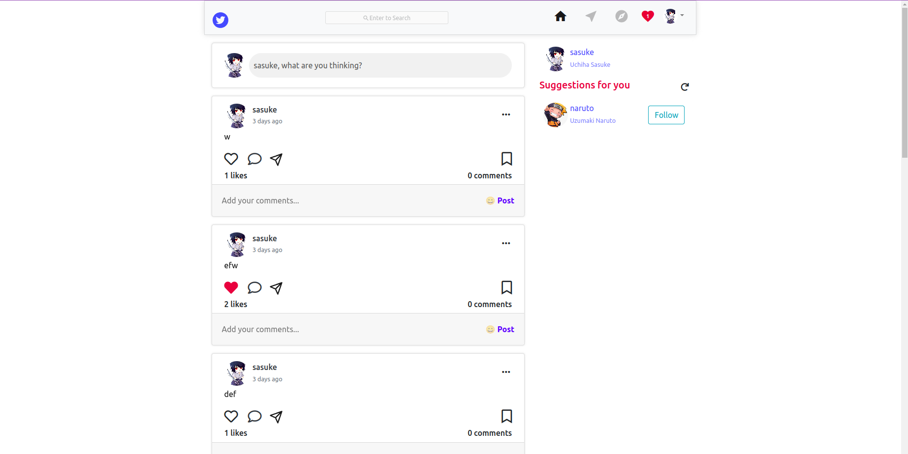
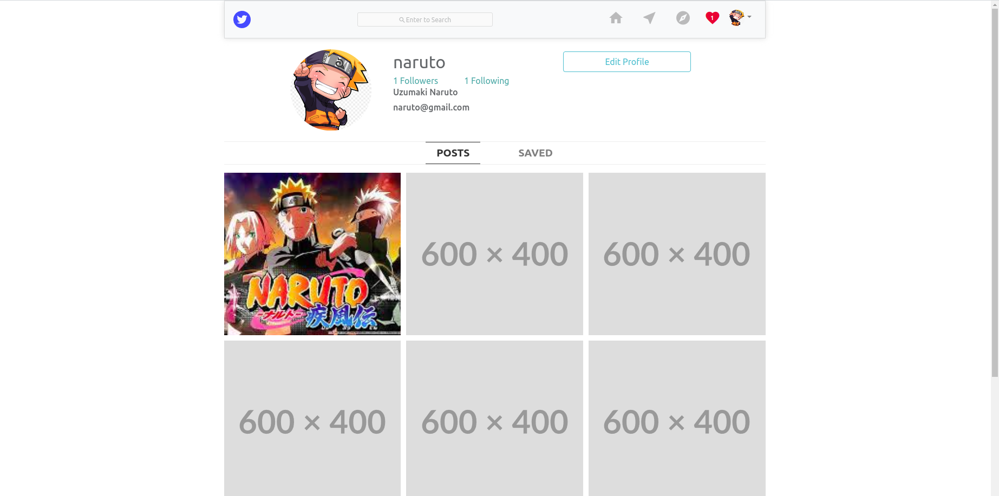
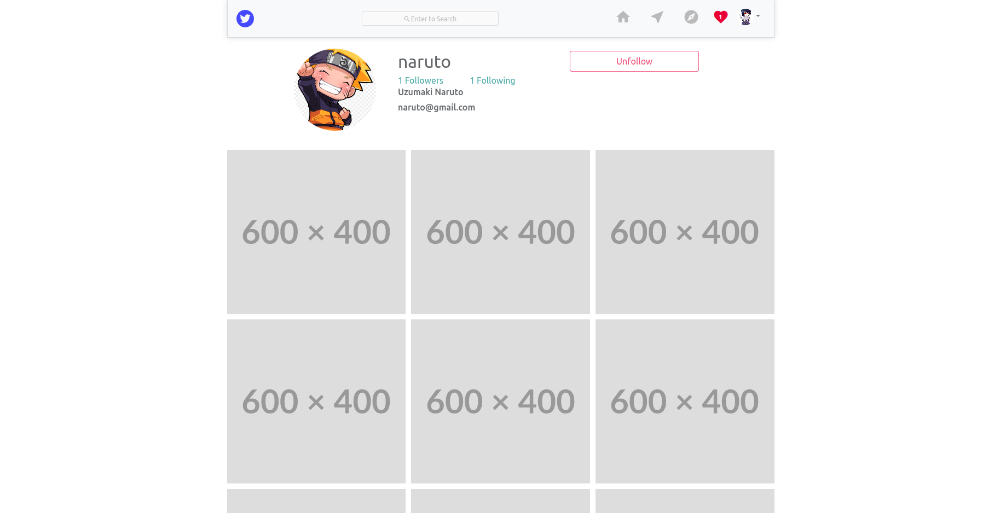

<h1>Aloha Web</h1>
<p>Aloha is MERN stack application with some social media's main features</p>

### Techstack
- React
- Redux, Redux Thunk
- Socket Io

### Requirements
- Node >= 16, yarn

### Development Setup

- Create .env file from .env.exampl
```
cp .env.example .env
```

- Start app
```
yarn start
```

- Server runs on `https://localhost:3000`

### Screens
- Login, Register


- Home

- Post new post

- Comments/ Like

- Send messages, online users

- Notification

- Suggestion

- Profile

- Follow/ unfollow


### Demo
Please click [here](https://aloha-web-git-master-tangkhanhchuong.vercel.app/) for demo